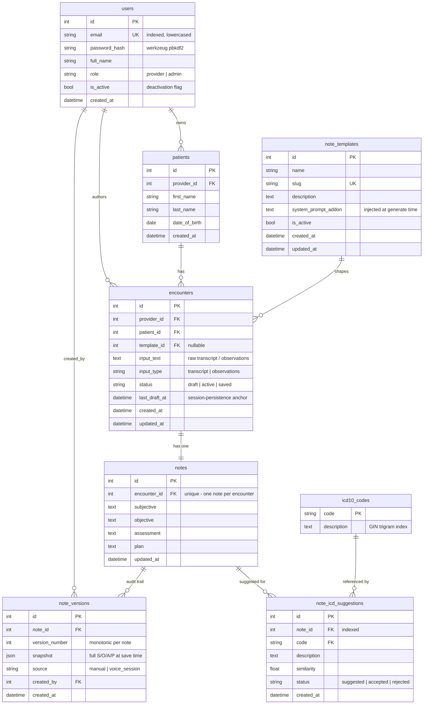

# Architecture

Kyron Scribe is a provider-facing AI clinical documentation platform: a
provider pastes an encounter transcript (or types freeform observations), the
system streams a structured SOAP note back into an editable workspace, suggests
ICD-10 codes, and supports conversational voice editing of the note. Everything
persists to Postgres with an append-only version history.

- **Frontend:** Vite + React + TypeScript (SPA)
- **Backend:** Flask + SQLAlchemy, JWT auth, blueprints per resource
- **Database:** PostgreSQL 16 (AWS RDS in prod), `pg_trgm` for ICD-10 search
- **LLM:** OpenAI Chat Completions (streaming SOAP + ICD rerank) and OpenAI
  Realtime over WebRTC (voice editing / dictation)
- **Infra:** AWS EC2 behind nginx (TLS), RDS in a private subnet, secrets in
  SSM Parameter Store

---

## Entity–relationship diagram



### Schema decisions worth defending

- **Patient identity is a composite unique key**, not a free-form field:
  `uq_patient_provider_identity` on `(provider_id, first_name, last_name,
  date_of_birth)` (`models.py`). This is what makes "find-or-create patient" and
  the returning-patient path deterministic — the same person across visits
  resolves to one row, while two patients who share a name but differ by DOB stay
  distinct. Patients are scoped per provider, matching the tenancy rule that
  providers only see their own patients.
- **`notes` is 1:1 with `encounters`** (`encounter_id` unique). The *live*
  note is a single mutable row; history is never stored by mutating it.
- **`note_versions` is append-only.** Every save writes a new row with an
  incrementing `version_number` and a full JSON `snapshot` — prior versions are
  never overwritten or deleted, satisfying the audit-trail requirement. `source`
  records whether a version came from a manual save or a voice session, and
  `created_by` records who saved it. Restore doesn't rewind — it writes a *new*
  version whose snapshot equals the restored one, so the trail stays linear.
- **ICD suggestions are their own table** rather than a column on the note, so
  a provider's accept/reject decisions survive re-running suggestion (only
  `status = 'suggested'` rows are replaced; accepted/rejected rows are kept).
- **`icd10_codes.description` carries a GIN trigram index** (migration `002`,
  `CREATE EXTENSION pg_trgm`) so plain-English symptom search is an indexed
  similarity query, not a table scan or an external API call.

---

## Request trace: streaming SOAP generation

`POST /api/encounters/:id/generate` (`routes/encounter_routes.py`) is the core
workflow, and it streams end-to-end — no spinner-then-dump.

1. **Auth + tenancy.** `@provider_required` decodes the JWT, loads the user,
   rejects deactivated accounts (403 `account_deactivated`), and
   `_get_owned_encounter` scopes the encounter to the caller (admins excepted).
2. **Template resolved live.** If the encounter has a `template_id`, the
   template's `system_prompt_addon` is re-read from the DB *at request time*
   (`db.session.get(NoteTemplate, ...)`), so an admin editing a template takes
   effect on the provider's very next generation — no page refresh, no cached
   prompt.
3. **Prior history injected server-side.** `fetch_prior_notes(patient_id, ...)`
   (`soap_service.py`) queries the patient's prior *saved* encounters and formats
   them into a history block. This is a backend function call during generation —
   the frontend never sees or sends prior notes — which is exactly the
   requirement's new-vs-returning-patient distinction. A `context` SSE event
   tells the UI whether history was found so it can render the "Returning
   patient" badge.
4. **Streaming assembly.** `stream_soap_note` (`soap_service.py`) opens a
   streaming Chat Completion and parses `### SECTION` markers *as tokens
   arrive*. The tricky part: a marker like `### ASSESSMENT` can be split across
   two stream chunks, so the assembler keeps a rolling `buffer`, only flushes
   text that can't still be part of a pending marker (`max_marker_len` lookback),
   and emits `section_start` / `section_delta` / `section_end` events per
   section. The provider watches S → O → A → P fill in live.
5. **Transport.** Events are serialized as Server-Sent Events. nginx is
   configured with `proxy_buffering off` on `/api/` (`deploy/nginx.conf`) so the
   reverse proxy doesn't defeat the streaming by buffering the whole response.
6. **Persistence.** When the stream completes, the final note is upserted into
   the `notes` row inside `stream_with_context` — so a generated draft survives a
   refresh even before the provider explicitly saves.

**Non-happy path (built in, not bolted on):** `looks_nonclinical()` gates the
call. Gibberish / empty / keyword-free short input never reaches the LLM — the
server streams a fixed `REFUSAL_NOTE` that explains insufficient clinical content
instead of hallucinating a visit.

```
Browser (useSoapStream)
   │  POST /generate  (JWT)
   ▼
@provider_required → _get_owned_encounter → resolve template (live) → fetch_prior_notes
   │
   ▼
stream_soap_note ── OpenAI streaming ──► marker-split assembler
   │  yields SSE: context, section_start, section_delta, section_end, done
   ▼
nginx (proxy_buffering off) ──► Browser renders S/O/A/P progressively
   │
   └─ on done: upsert notes row (draft survives refresh)
```

---

## Request trace: voice editing (propose → confirm)

The voice assistant never edits the note silently. It *proposes*, the provider
*confirms*.

1. `POST /api/encounters/:id/realtime/session` mints a short-lived OpenAI
   Realtime **client secret** server-side (`realtime_service.py`). The real API
   key never reaches the browser; the ephemeral secret does.
2. The browser opens a WebRTC connection **directly to OpenAI** for audio
   (`useRealtimeVoice.ts`) — mic in, voice out — so audio never round-trips
   through our backend.
3. The Realtime model is given two function tools:
   - `apply_soap_edits` — stages a proposal (full updated text per changed
     section). Explicitly **does not save**.
   - `confirm_pending_edits` — applies the pending proposal, only when the
     provider verbally accepts.
4. `useSoapProposal.ts` holds the proposal as a diff against the *committed*
   note. Re-invoking `apply_soap_edits` before confirmation re-diffs against the
   original committed text (not the previous proposal), so successive voice
   refinements always show the true net change. `SoapSectionDiff.tsx` renders
   word-level green additions / struck-through red deletions.
5. Confirm (button **or** voice) merges the section into the note; reject
   discards it. Saving afterward writes a `note_versions` row with
   `source = 'voice_session'`.

Dictation mode (`useDictation.ts`) uses a separate transcription-only Realtime
session (`/realtime/transcription-session`) — streaming speech-to-text with no
tools and no spoken responses — and debounced re-generation as utterances land.

> Browser mic access (`getUserMedia`) is blocked on insecure origins, so voice
> only works over HTTPS or `localhost` — one reason TLS is mandatory, not
> cosmetic.

---

## Auth & multi-role access

- Stateless **JWT** (HS256, 24h expiry), signed with `JWT_SECRET` from SSM.
  Payload carries `sub`, `email`, `role`, `iat`, `exp` (`auth.py`).
- Three decorators compose the policy: `login_required` (valid token + active
  user), `provider_required` (provider or admin), `admin_required` (admin only).
- **Deactivation is enforced on every request**, not just at login: a token for
  a since-deactivated user returns 403 `account_deactivated` mid-session, which
  is how "admin deactivates a provider mid-draft" is handled without data loss —
  the draft stays in RDS.
- Passwords are `werkzeug` pbkdf2 hashes; email is stored/compared lowercased
  and uniquely indexed.

---

## Infrastructure

```
Internet ──HTTPS──► nginx (EC2, :443, Let's Encrypt)
                      ├─ /api/*  ──► gunicorn @127.0.0.1:5001 (Docker, not exposed)
                      └─ /*      ──► static SPA build (/var/www/kyron/dist)
                                          │
gunicorn ──(SQLAlchemy pool, pre-ping)──► RDS Postgres (private subnet)
   secrets ◄── SSM Parameter Store (/kyron/prod/*, via EC2 IAM role)
```

- **RDS is not publicly accessible** — `PubliclyAccessible: false`, and its
  security group only accepts `5432` from the EC2 security group. The app process
  is bound to `127.0.0.1:5001` inside a container; only nginx faces the internet.
- **No secrets in the repo or on the box.** `secrets_loader.py` reads
  `DATABASE_URL` / `JWT_SECRET` / `OPENAI_API_KEY` from SSM Parameter Store at
  container boot via the instance's IAM role. Locally it falls back to `.env`
  (gitignored). There is no `.env` file on the production instance.
- **Connection pooling** is configured on the SQLAlchemy engine (`app.py`):
  `pool_size`, `max_overflow`, `pool_pre_ping` (survives RDS idle-drops), and
  `pool_recycle`. The instance does not open a new DB connection per request.
- TLS via certbot (`--nginx`), auto-renewing; HTTP redirects to HTTPS.

See [`deploy/DEPLOYMENT.md`](../deploy/DEPLOYMENT.md) for concrete resource IDs
and the redeploy procedure.

---

## Deliberate trade-offs / what I'd do next

- **Prior-history retrieval** is a direct server-side function call
  (`fetch_prior_notes`) rather than an OpenAI tool/function call the model
  decides to invoke. This satisfies the "backend retrieval, not frontend prompt
  stuffing" requirement and is cheaper and more deterministic; the tool-calling
  variant (let the model request history) is the natural next step if we want the
  model to decide *when* history is relevant.
- **ICD-10 search is trigram similarity**, not embeddings. For a ~300-code demo
  subset (and even the full CMS list) `pg_trgm` is fast, dependency-free, and
  needs no vector store; an embedding/pgvector approach would improve recall on
  paraphrased symptoms and is the upgrade path.
- **Deploys are `rsync` + a shell script**, not CI/CD. Fine for a take-home;
  a GitHub Actions pipeline + blue/green would be next, along with CloudWatch
  alarms (today the only resilience is Docker `restart: unless-stopped`).
